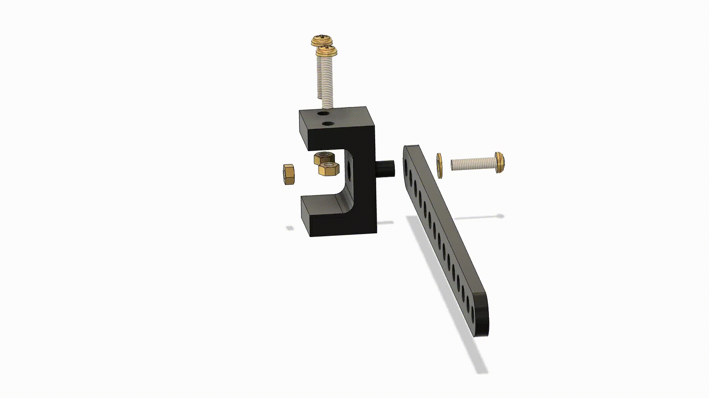
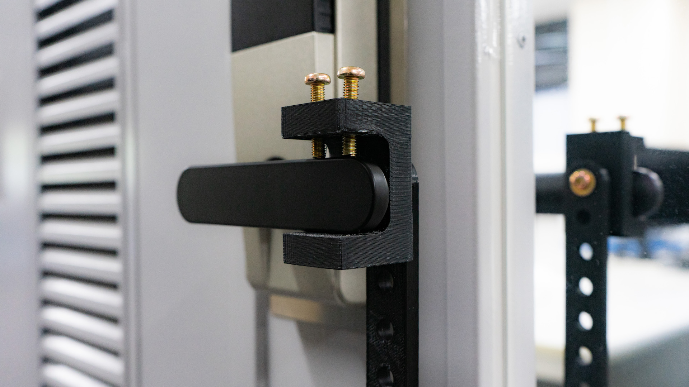
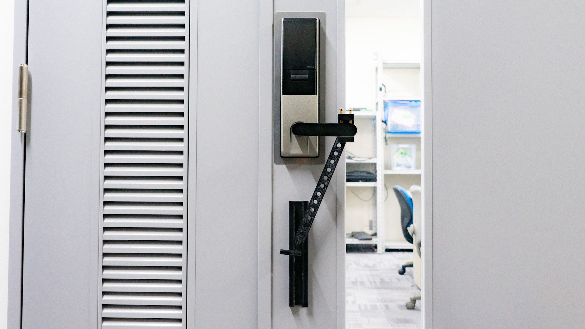
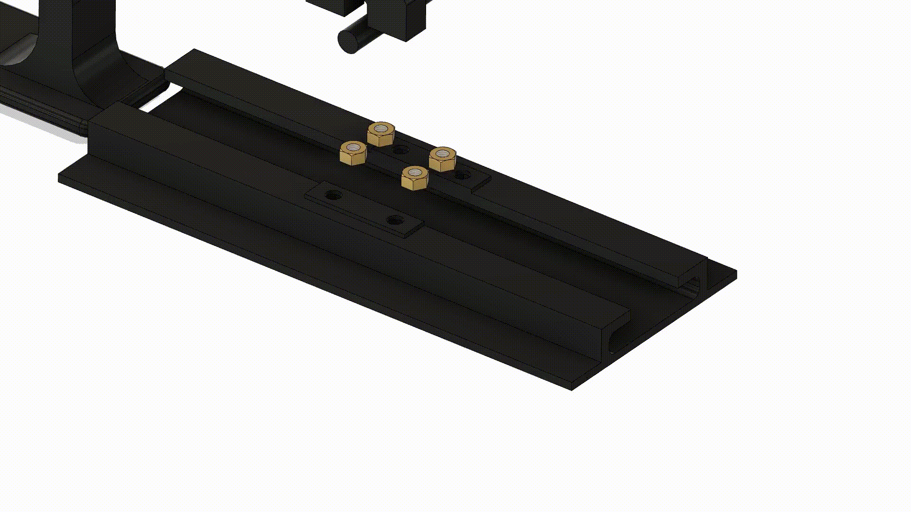
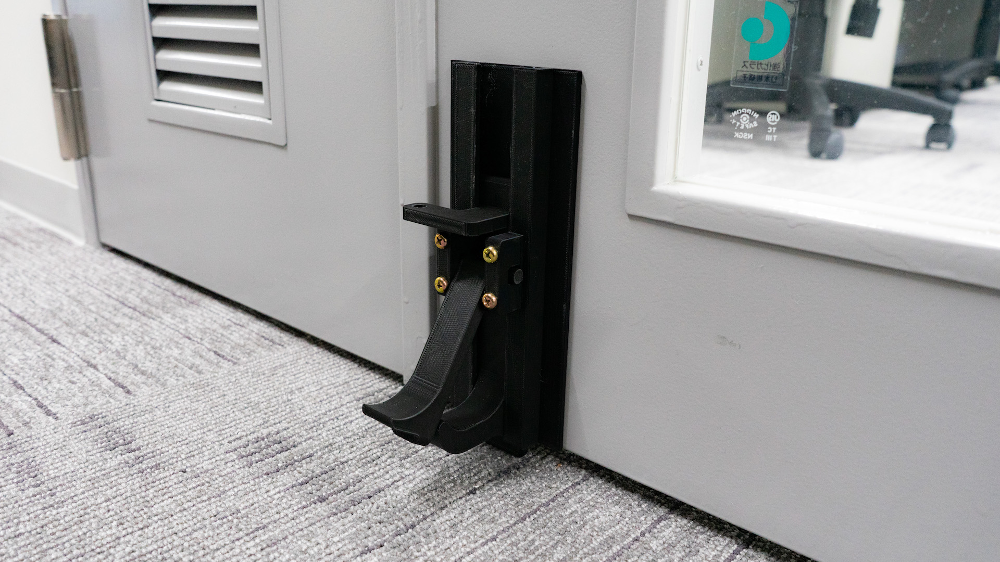
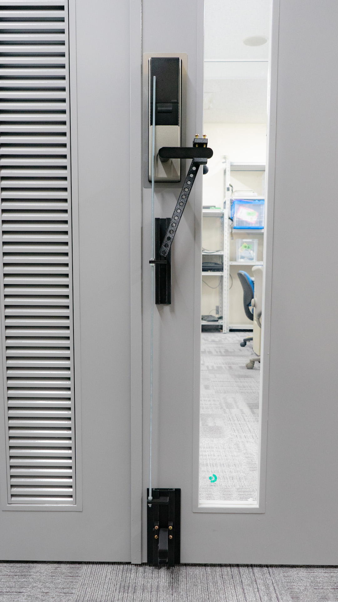

# 3D Printable Attachment for Open a Door without Hand

## About / 概要

There is always a door at the partition of the room, and we touch the doorknob multiple times a day.
Recently, COVID-19 has become widespread, and we have to work to prevent infection.
Considering that unspecified number of people are touching the doorknob every day, another way of opening the door is needed.
So I devised a way to open the door without touching the doorknob.
Consisting of parts that can be printed with a personal 3D printer and screws / bolts available at home centers,
It can be attached to a lever type door knob. (Google Translated)

部屋の区切りには必ずドアは存在し、私達は1日に複数回にわたってドアノブを触ります。
2020年5月現在、新型コロナウイルスの流行により、手指衛生を伴う感染予防は私たちの生活に必要不可欠になりました。
手指衛生の観点からドアノブに手で触れずに日常生活を行うために、ドアをドアノブにふれることなく開ける方法を考案しました。パーソナルな3Dプリンタで印刷できる部品とホームセンターで手に入るネジ/ボルトで構成され、レバータイプのドアノブに取り付けが可能です。


## Parts List / 部品リスト


|Number/番号|Component Name/パーツ名|Quantity/個数|Printable STL data/STLデータ| CAD Data (.step)/CADデータ|Other/備考|
|:-:|:-:|-|-|-|-|
|1|Knob Attachment/ノブアタッチメント| 1 | [Download](https://github.com/DigitalNatureGroup/FootKnob/raw/master/stl/attachment.stl) | [Download](https://github.com/DigitalNatureGroup/FootKnob/raw/master/step/attachment.step) | |
|2|Link/リンク| 1 | [Download](https://github.com/DigitalNatureGroup/FootKnob/raw/master/stl/link.stl) | [Download](https://github.com/DigitalNatureGroup/FootKnob/raw/master/step/link.step) | |
|3|Slider/スライダ| 1 | [Download](https://github.com/DigitalNatureGroup/FootKnob/raw/master/stl/slider_left.stl) | [Download](https://github.com/DigitalNatureGroup/FootKnob/raw/master/step/slider.step) |Knob on the left/ドアノブが左の場合|
|-|Slider/スライダ| 1 | [Download](https://github.com/DigitalNatureGroup/FootKnob/raw/master/stl/slider_right.stl) | [Download](https://github.com/DigitalNatureGroup/FootKnob/raw/master/step/slider.step) |Knob on the right/ドアノブが右の場合|
|4|Guide Rail(Upper)/ガイドレール(上)| 1 | [Download](https://github.com/DigitalNatureGroup/FootKnob/raw/master/stl/guiderail_upper.stl) | [Download](https://github.com/DigitalNatureGroup/FootKnob/raw/master/step/guiderail_upper.step) | |
|5|Guide Rail(Lower)/ガイドレール(下)| 1 | [Download](https://github.com/DigitalNatureGroup/FootKnob/raw/master/stl/guiderail_lower.stl) | [Download](https://github.com/DigitalNatureGroup/FootKnob/raw/master/step/guiderail_lower.step) | |
|6|Pedal/ペダル| 1 | [Download](https://github.com/DigitalNatureGroup/FootKnob/raw/master/stl/pedal.stl) | [Download](https://github.com/DigitalNatureGroup/FootKnob/raw/master/step/pedal.step) | |
|7|Pedal Slider/ペダルスライダ| 1 | [Download](https://github.com/DigitalNatureGroup/FootKnob/raw/master/stl/pedalslider_left.stl) | [Download](https://github.com/DigitalNatureGroup/FootKnob/raw/master/step/pedalslider.step) |Knob on the left/ドアノブが左の場合|
|-|Pedal Slider/ペダルスライダ| 1 | [Download](https://github.com/DigitalNatureGroup/FootKnob/raw/master/stl/pedalslider_right.stl) | [Download](https://github.com/DigitalNatureGroup/FootKnob/raw/master/step/pedalslider.step) |Knob on the right/ドアノブが右の場合|
|8|Cap/キャップ| 2 | [Download](https://github.com/DigitalNatureGroup/FootKnob/raw/master/stl/cap.stl) | [Download](https://github.com/DigitalNatureGroup/FootKnob/raw/master/step/cap.step) | |
|9|M5 Hexagon nut/M5 六角ナット| 7 | - | - | |
|10|M5x20mm Screw/M5x20mm ネジ| 5 | - | - | |
|11|M5x25mm Screw/M5x25mm ネジ| 2 | - | - | |
|12|M5 Washer/M5 ワッシャー| 1 | - | - | |
|(13)|M6 Flush Cut Bolt/M6全ねじ| 1 | - | - |【Optional】Linker of Each Slider/【オプション】スライダ同士を繋ぐ用|
|(14)|M6 Hexagon nut/M6 六角ナット| 4 | - | - |【Optional】Linker of Each Slider/【オプション】スライダ同士を繋ぐ用|

## How to Build / 組み立て方

1. Assemble the attachment part to the door knob / ドアノブへのアタッチメント部分を組み立て

1. Attach the attachment part to the door knob / アタッチメント部分をドアノブに取り付け

1. Attach the slider and guide to the door and connect the links / スライダ,ガイドをドアに取り付けてリンクを繋ぐ

1. Assemble the pedal part / ペダル部分を組み立て

1. Attach the pedal part to the door / ペダル部分をドアの取り付け

1. Connect each slider / スライダ同士を繋ぐ
1. Finish / 完成



# Citation / 引用
```
@misc{FootKnob2020,
    author  = {Tatsuya Minagawa},
    title   = {3D Printable Attachment for Opening a Door without Hand},
    note    = {\url{https://github.com/DigitalNatureGroup/FootKnob}},
    year    = {2020}
    month   = {may}
}
```
