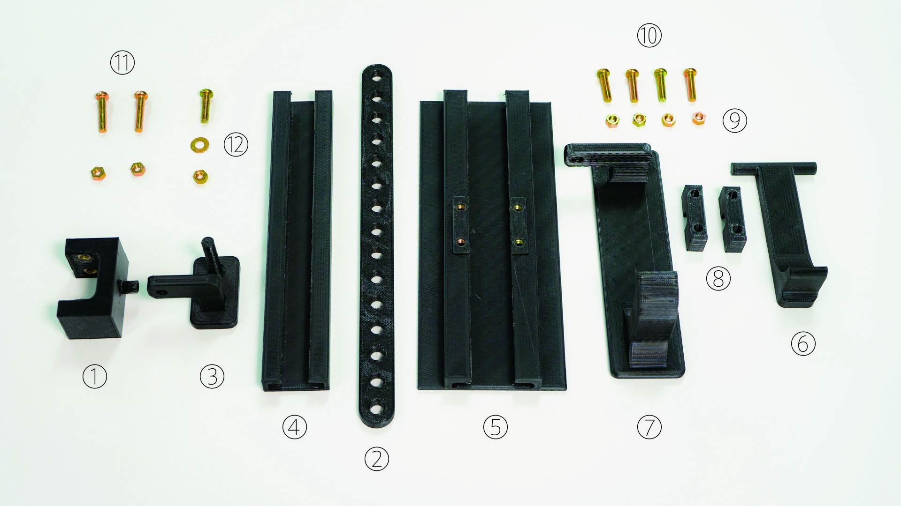

# 3D Printable Attachment for Open a Door without Hand

## What This / 概要

There is always a door at the partition of the room, and we touch the doorknob multiple times a day.
Recently, COVID-19 has become widespread, and we have to work to prevent infection.
Considering that unspecified number of people are touching the doorknob, it is impossible to touch the doorknob in terms of countermeasures against contact infection.
So I devised a way to open the door without touching the doorknob.
Consists of parts that can be printed with a personal 3D printer and screws / bolts available at home centers,
It can be attached to a lever type door knob.

部屋の区切りには必ずドアは存在し、私達は1日に複数回にわたってドアノブを触ります。  
最近、ウイルス性の病気が流行しており、感染予防に私達は務めなければいけなくなりました。  
不特定多数の人たちがドアノブに触れていると考えると、接触感染の対策の観点からドアノブに触れることができません。  
そこで、ドアをドアノブにふれることなく開ける方法を私は考案しました。  
パーソナルな3Dプリンタで印刷できる部品とホームセンターで手に入るネジ/ボルトで構成され、
レバータイプのドアノブに取り付けが可能です。

## Parts List / 部品リスト

|Number/番号|Component Name/パーツ名|Quantity/個数|Printable STL data/STLデータ| CAD Data (.step)/CADデータ|Other/備考|
|:-:|:-:|-|-|-|-|
|1|Knob Attachment/ノブアタッチメント| 1 | [Download](https://github.com/cha84rakanal/FootKnob/raw/master/stl/attachment.stl) | [Download](https://github.com/cha84rakanal/FootKnob/raw/master/step/attachment.step) | |
|2|Link/リンク| 1 | [Download](https://github.com/cha84rakanal/FootKnob/raw/master/stl/link.stl) | [Download](https://github.com/cha84rakanal/FootKnob/raw/master/step/link.step) | |
|3|Slider/スライダ| 1 | [Download](https://github.com/cha84rakanal/FootKnob/raw/master/stl/slider_left.stl) | [Download](https://github.com/cha84rakanal/FootKnob/raw/master/step/slider.step) |Knob on the left/ドアノブが左の場合|
|-|Slider/スライダ| 1 | [Download](https://github.com/cha84rakanal/FootKnob/raw/master/stl/slider_right.stl) | [Download](https://github.com/cha84rakanal/FootKnob/raw/master/step/slider.step) |Knob on the right/ドアノブが右の場合|
|4|Guide Rail(Upper)/ガイドレール(上)| 1 | [Download](https://github.com/cha84rakanal/FootKnob/raw/master/stl/guiderail_upper.stl) | [Download](https://github.com/cha84rakanal/FootKnob/raw/master/step/guiderail_upper.step) | |
|5|Guide Rail(Lower)/ガイドレール(下)| 1 | [Download](https://github.com/cha84rakanal/FootKnob/raw/master/stl/guiderail_lower.stl) | [Download](https://github.com/cha84rakanal/FootKnob/raw/master/step/guiderail_lower.step) | |
|6|Pedal/ペダル| 1 | [Download](https://github.com/cha84rakanal/FootKnob/raw/master/stl/pedal.stl) | [Download](https://github.com/cha84rakanal/FootKnob/raw/master/step/pedal.step) | |
|7|Pedal Slider/ペダルスライダ| 1 | [Download](https://github.com/cha84rakanal/FootKnob/raw/master/stl/pedalslider_left.stl) | [Download](https://github.com/cha84rakanal/FootKnob/raw/master/step/pedalslider.step) |Knob on the left/ドアノブが左の場合|
|-|Pedal Slider/ペダルスライダ| 1 | [Download](https://github.com/cha84rakanal/FootKnob/raw/master/stl/pedalslider_right.stl) | [Download](https://github.com/cha84rakanal/FootKnob/raw/master/step/pedalslider.step) |Knob on the right/ドアノブが右の場合|
|8|Cap/キャップ| 2 | [Download](https://github.com/cha84rakanal/FootKnob/raw/master/stl/cap.stl) | [Download](https://github.com/cha84rakanal/FootKnob/raw/master/step/cap.step) | |
|9|M5 Hexagon nut/M5 六角ナット| 7 | - | - | |
|10|M5x20mm Screw/M5x20mm ネジ| 5 | - | - | |
|11|M5x25mm Screw/M5x25mm ネジ| 2 | - | - | |
|12|M5 Washer/M5 ワッシャー| 1 | - | - | |

## How to Build / 組み立て方